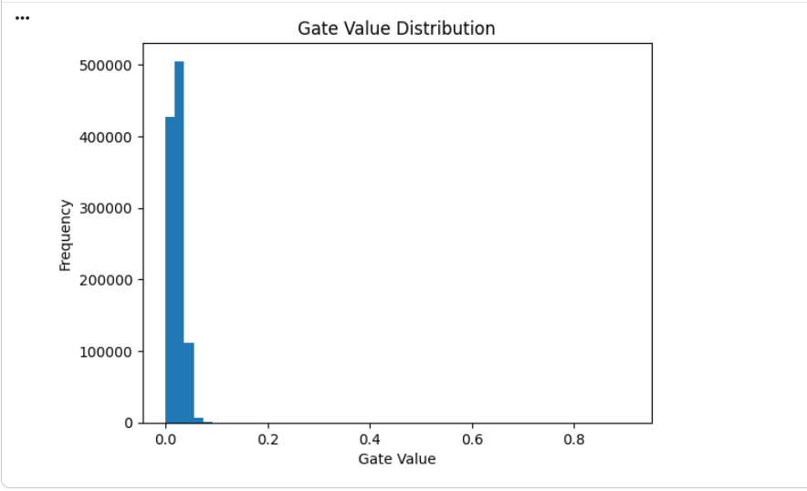

# Self-Pruning Neural Networks Report

## 1. Introduction

In modern deep learning, large models often contain redundant parameters.
Pruning helps reduce model size and computation cost.

In this project, we implement a **self-pruning neural network** that learns which weights to remove during training.

---

## 2. Why L1 Regularization Encourages Sparsity

L1 regularization adds a penalty proportional to the sum of absolute values:

Sparsity Loss = Σ |gates|

Since gates are between 0 and 1, minimizing this loss pushes many values toward zero.

This results in:

* Many gates becoming exactly zero
* Corresponding weights being effectively removed

Thus, L1 promotes **sparse solutions**.

---

## 3. Methodology

### Prunable Layer

Each weight has a learnable gate:

* gate = sigmoid(gate_score)
* pruned_weight = weight × gate

### Loss Function

Total Loss = Classification Loss + λ × Sparsity Loss

---

## 4. Results

| Lambda | Accuracy | Sparsity |
| ------ | -------- | -------- |
| 1e-5   | 74.64%   | 6.18%    |
| 1e-4   | 72.94%   | 10.64%   |
| 1e-3   | 71.20%   | 13.45%   |

---

## 5. Gate Distribution

Observation:

* Large spike near 0 → successful pruning
* Some gates remain active → important connections

---

## 6. Conclusion

* The model successfully learns to prune itself
* Higher λ increases sparsity
* However, excessive pruning reduces accuracy

This demonstrates the trade-off between:

* Model efficiency
* Model performance
